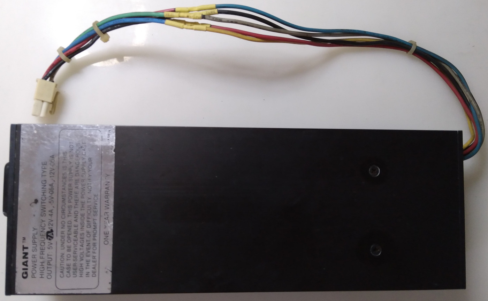
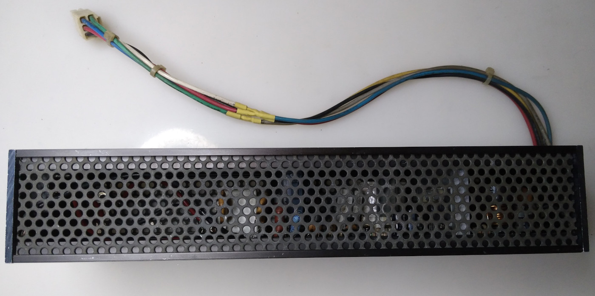
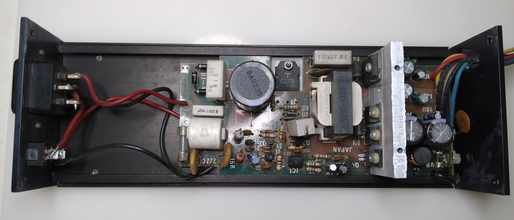
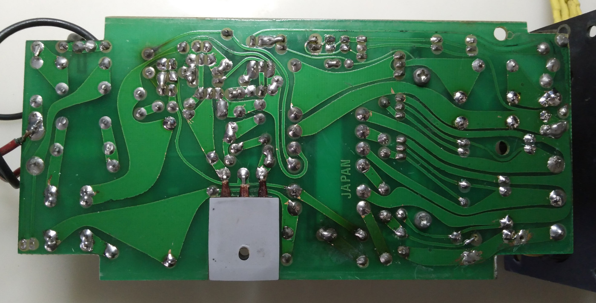

# Schematic for GIANT Apple II PSU - 5V 7A, 12V 4A, -5V 0.5A, -12V 0.5A switching power supply

Reverse engineered by Khralkatorrix.

Note: this PSU need to be loaded on 5V rail for 5V rail voltage to stabilized, else it will measure at 7V-ish with no load.

### Images

